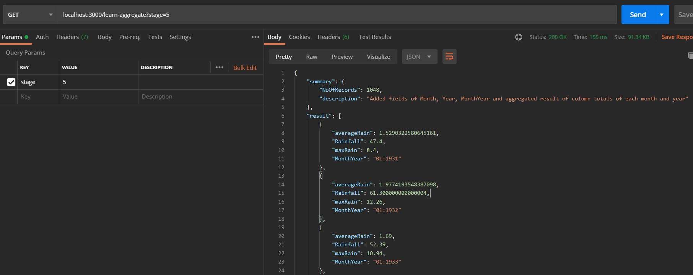

## Add fields in aggregate

- localhost:3000/learn-aggregate?stage=1
  

## Added fields of Month, Year, MonthYear and aggregated result of grand totals for the entire series

- localhost:3000/learn-aggregate?stage=2
  

## Added fields of Month, Year, MonthYear and aggregated result of column totals of each month

- localhost:3000/learn-aggregate?stage=3
  

## Added fields of Month, Year, MonthYear and aggregated result of column totals of each year

- localhost:3000/learn-aggregate?stage=4
  

## Added fields of Month, Year, MonthYear and aggregated result of column totals of each month and year

- localhost:3000/learn-aggregate?stage=5
  

## Added fields of Month, Year, MonthYear, and aggregated result of grand totals for the entire series, and aggregated result of column totals of each month, and aggregated result of column totals of each year, and aggregated result of column totals of each month and year

- localhost:3000/learn-aggregate?stage=facet
  
  
  
  

## The \$bucket aggregation can provide some features that are hard to do any other way

- localhost:3000/learn-aggregate?stage=bucket
  

- localhost:3000/learn-aggregate?stage=simple-bucket
  

- localhost:3000/learn-aggregate?stage=bucket-auto
  

- localhost:3000/learn-aggregate?stage=facet-and-bucket
  
